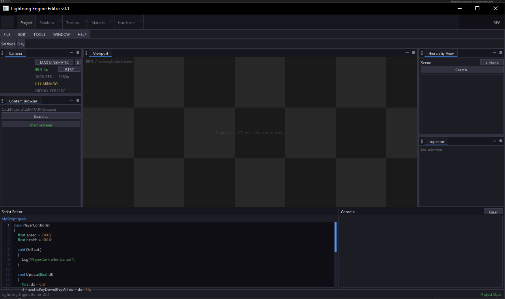

# Listados arqui os problemas encontrados no projeto, para que possam ser corrigidos e evitados no futuro.

# Problema 1: Inconsistência na UI

1. Menu de Contexto: Zorder misturado, às vezes atrás de outros elementos.