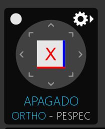

# Viewport2D e Viewport3D

As Viewports são as janelas principais do editor onde os desenvolvedores podem visualizar e interagir com a cena. A Viewport2D é usada para visualização em 2D, enquanto a Viewport3D é usada para visualização em 3D. Ambas as viewports devem ser capazes de exibir a cena de forma clara e responsiva, permitindo aos desenvolvedores manipular objetos, ajustar câmeras e visualizar mudanças em tempo real.

- Posicionar Elementos na Viewport: Os elementos da cena devem ser posicionados corretamente dentro da viewport, garantindo que sejam visíveis e acessíveis para os desenvolvedores.
- Interação com a Viewport: Os desenvolvedores devem ser capazes de interagir com a viewport usando o mouse e o teclado, permitindo a seleção, movimentação, rotação e escala de objetos na cena.
- Incorporar Viewports em Layouts Diferentes: Visualizador de Objetos3D, Visualizador de Cenas, Visualizador de Materiais, etc. As viewports devem ser flexíveis o suficiente para serem incorporadas em diferentes layouts do editor, permitindo aos desenvolvedores personalizar sua interface de acordo com suas necessidades.
- Suporte a Múltiplas Viewports: O editor deve suportar a abertura de múltiplas viewports simultaneamente, permitindo aos desenvolvedores trabalhar em diferentes aspectos da cena ao mesmo tempo, como uma viewport para visualização em 3D e outra para visualização em 2D.

## Viewport2D

- A Viewport2D é a janela principal do editor onde os desenvolvedores podem visualizar e interagir com a cena em 2D.
- Gizmos: A Viewport2D deve suportar gizmos para manipulação de objetos, permitindo aos desenvolvedores mover, rotacionar e escalar objetos na cena usando ferramentas visuais.
- Turn On/Off de Grid: A Viewport2D deve permitir aos desenvolvedores ligar ou desligar a grade de referência, facilitando a organização e alinhamento dos objetos na cena.
- Snap to Grid: A Viewport2D deve oferecer a opção de snap to grid, permitindo aos desenvolvedores alinhar objetos automaticamente à grade de referência para uma organização mais precisa.
- Ferramentas de Transformação: A Viewport2D deve fornecer ferramentas de transformação, como mover, rotacionar e escalar, para permitir aos desenvolvedores manipular objetos na cena de forma intuitiva.
- Visualização de Camadas: A Viewport2D deve permitir aos desenvolvedores visualizar e gerenciar camadas na cena, facilitando a organização e controle dos objetos.
- Visualização de Gizmos: A Viewport2D deve permitir aos desenvolvedores visualizar gizmos para manipulação de objetos, facilitando a interação e edição da cena.
- Mudanças de Renderização: A Viewport2D deve ser capaz de refletir mudanças de renderização em tempo real, permitindo aos desenvolvedores ver os efeitos de suas alterações imediatamente.
- Visualização de Câmeras: A Viewport2D deve permitir aos desenvolvedores visualizar a cena a partir de diferentes câmeras, facilitando a navegação e exploração da cena.
- Navegação na Viewport2D deve ser fluida e responsiva, permitindo aos desenvolvedores se moverem pela cena de forma eficiente e sem atrasos.
- Pan, Zoom e Rotação: A Viewport2D deve suportar pan, zoom e rotação para permitir aos desenvolvedores navegar pela cena de forma intuitiva e eficiente.
- Visualização de Iluminação: A Viewport2D deve ser capaz de exibir a iluminação da cena, permitindo aos desenvolvedores ver os efeitos de luz e sombra em tempo real.
- Visualização de Sombreamento: A Viewport2D deve ser capaz de exibir o sombreamento da cena, permitindo aos desenvolvedores ver os efeitos de materiais e texturas em tempo real. (Configurações Globais de Renderização, ou Local por Cena, PostFx de Renderização, etc. dependente do modulo a qual a viewport estiver acoplada)
- Cube View:  Os Controles de viewport devem ser adaptados para cada tipo de visualização, como top, front, side e perspective, permitindo aos desenvolvedores escolher a melhor perspectiva para trabalhar em sua cena. e travar

## Viewport3D

- Todas as funcionalidades da Viewport2D devem ser suportadas na Viewport3D, além de funcionalidades específicas para visualização em 3D.
- Navegação em 3D: A Viewport3D deve suportar navegação em 3D, permitindo aos desenvolvedores se moverem pela cena em todas as direções e ângulos. Segurando botao direito do mouse + WASD para movimentação, e E e Q para subir e descer, ou seja, movimentação livre em 3D.
