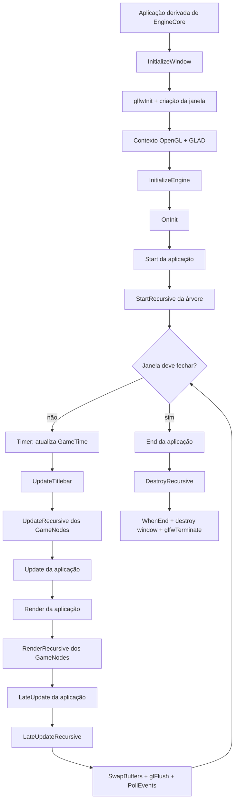

# Lightning Engine v0.14.0 — exploração técnica

## 1. Escopo e leitura do snapshot

Este documento descreve o comportamento implementado nesta pasta, não apenas a intenção sugerida pelos nomes das classes. A versão é identificada no código por `APP_VERSION_STRING "0.14.0.0"` em `System.h` e pelo nome da solução `Lightning Engine 0.14.0`.

O snapshot é um protótipo funcional de infraestrutura gráfica, mas ainda não é uma distribuição pronta para uso. O núcleo está presente; o ponto de entrada em `main.cpp` não inicia nenhuma aplicação, vários recursos têm apenas a API ou um esqueleto e há problemas de ciclo de vida que devem ser considerados ao evoluir o código.

## 2. Mapa do repositório

| Área | Conteúdo | Papel |
| --- | --- | --- |
| `Engine.h`, `core/engine/Engine.cpp` | `EngineCore` | Janela, contexto OpenGL, ciclo de vida e laço por frame |
| `Types.h`, `System.h`, `GameTime.h` | Tipos, enums e estado global | Vetores, cores, transformações, configurações, tempo e matrizes |
| `Inputs.h`, `core/editor/Inputs.cpp` | `Inputs` | Consulta de teclado/mouse e captura do cursor |
| `Msg.h`, `core/editor/Msg.cpp`, `Match.h` | Mensagens e condições | Console colorido, erros fatais, avisos e helpers de fluxo |
| `Shader.h`, `core/renderer/Shader.cpp` | `Shader` | Compilação/link de GLSL e envio de uniforms |
| `Shapes.h`, `core/renderer/Shapes.cpp` | `Shapes` | Retângulos e círculos desenhados com VAO/VBO/EBO |
| `Geometry.h`, `core/engine/Geometry.cpp` | `GeometryComponent`, `MeshComponent` | Meshes OpenGL e importação recursiva via Assimp |
| `Image.h`, `core/engine/Image.cpp` | `Image` | Texturas por `stb_image` e leitura de fontes de shader |
| `GameNode.h` | `GameNode`, `GameObject`, `GameComponent` | Hierarquia de cena, ownership e ciclo de vida completo |
| `UI.h`, `core/ui/UI.cpp` | `UINode`, `Canvas`, `Widget`, `Panel`, `Button`, `Label` | Árvore UI, layout em pixels, desenho 2D e eventos de ponteiro |
| `Sprite.h`, `core/renderer/Sprite.cpp` | `SpriteNode`, `AnimatedSpriteNode`, `SpriteAnimation` | Sprites 2D, spritesheets e animação por frames |
| `SceneComponent.h`, `core/components/SceneComponent.cpp` | `SceneComponent` | Componente de transformação legado, compatível com mesh e luz |
| `Camera.h`, `core/components/Camera.cpp` | `Camera` | View, projeção, movimento e Euler angles |
| `Lights.h`, `core/components/Lights.cpp` | `Light` | Dados de luz direcional e pontual enviados ao shader |
| `Spectator.h`, `core/components/Spectator.cpp` | `Spectator` | Ponte entre câmera, entrada e matrizes globais |
| `Shaders/` | GLSL 3.30 | Shaders de textura, iluminação, sólido e testes |
| `Samples/` | Modelos, materiais e imagens | Dados de teste e exemplos de importação |
| `Exemples/` | `SpaceIvaders`, `BlockBreaker` | Protótipos de aplicações derivadas de `EngineCore` |
| `third_party/` | GLFW, GLAD, Assimp, GLM | Dependências vendorizadas |

## 3. Arquitetura e fluxo de execução



### 3.1 Inicialização

`EngineCore::InitializeWindow`:

1. inicializa GLFW;
2. configura a versão OpenGL indicada por `EngineSettings`;
3. cria a janela e torna o contexto corrente;
4. cria `Inputs` associado à janela;
5. carrega as funções OpenGL por GLAD;
6. imprime versão do OpenGL, versão GLSL, vendor e renderer.

`EngineCore::InitializeEngine` chama, em ordem, `OnInit`, `OnRender` e `OnTerminate`. A implementação base de `OnInit` não faz nada. `OnRender` executa `Start` da aplicação, inicia a árvore com `GameNode::StartRecursive`, executa o laço `Rendering` e chama `End`. No encerramento, a árvore é destruída antes do contexto GLFW.

### 3.2 Ordem por frame

Dentro de `Rendering`, cada iteração faz:

1. `Timer()` chama `glfwGetTime()` e calcula `Time->deltaTime` como a diferença em relação ao frame anterior;
2. `UpdateTitlebar()` atualiza FPS e delta no título quando habilitados;
3. `GameNode::UpdateRecursive()` percorre a árvore ativa e chama os componentes habilitados;
4. `Update()` processa a lógica adicional da aplicação;
5. `Render()` emite os comandos de desenho da aplicação;
6. `GameNode::RenderRecursive()` percorre os nós e componentes renderizáveis;
7. `LateUpdate()` e `GameNode::LateUpdateRecursive()` executam a etapa posterior;
8. `glfwSwapBuffers`, `glFlush` e `glfwPollEvents` finalizam o frame.

O primeiro delta pode ser grande ou depender do estado inicial do relógio. Não existe callback de redimensionamento e `SetLimiter()` não é chamado pelo laço; portanto, a enumeração `Framerate` não limita o frame rate na prática.

## 4. Contrato para uma aplicação

Uma aplicação deve herdar de `EngineCore`, implementar os métodos virtuais puros e iniciar a janela. Os GameObjects são criados sob `GetSceneRoot()` e passam a ser atualizados/renderizados automaticamente:

```cpp
class MyGame : public LightningEngine::EngineCore {
public:
    MyGame() {
        settings.width = 1280;
        settings.height = 720;
        settings.title = "My Game";
        InitializeWindow(settings);
    }

    void Run() override { InitializeEngine(); }
    void Start() override {
        auto* player = GetSceneRoot().CreateChild<LightningEngine::GameNode>("Player");
        player->AddComponent<MyBehaviour>();
    }
    void Update() override { /* ler Input e atualizar estado */ }
    void Render() override { /* emitir comandos OpenGL */ }
    void End() override { /* liberar estado da aplicação */ }
};

int main() {
    MyGame game;
    game.Run();
}
```

`InitializeWindow` é usado diretamente pelos exemplos e deve ser tratado como parte do fluxo de inicialização desta versão. O `main.cpp` entregue na v0.14.0, porém, contém apenas `return 0`; o snippet acima é um caminho de integração, não o estado atual do executável.

`CreateChild` exige uma classe derivada de `GameNode`; para o caso comum, use `std::make_unique<GameObject>("Nome")` e `AddChild`. O exemplo acima é conceitual: `MyBehaviour` deve derivar de `GameComponent` e o construtor de `CreateChild` recebe os argumentos do tipo de nó.

## 5. Configuração e estado global

`EngineSettings` fornece, entre outros, largura, altura, título, versão lógica do engine, versão do contexto OpenGL, VSync, perfil core, double frame, FPS, versão no título, antialiasing e redimensionamento. Na implementação atual, somente parte desses campos chega ao GLFW ou ao laço:

- `width`, `height`, `title`, `version_major`, `version_minor` e `core_profile` participam da criação da janela;
- `displayFPS` e `displayVersion` participam do título;
- `vsync`, `doubleFrame`, `AA` e `cansize` são armazenados, mas não aplicados;
- `version.Text` só aparece se tiver sido preenchido; os construtores padrão de `Version` não montam automaticamente o texto da versão.

`System.h` cria variáveis `static` por unidade de tradução para `Settings`, `mouse`, `Time`, `model`, `view` e `projection`. Isso simplifica o protótipo, mas significa que não existe um único objeto de estado compartilhado de forma explícita entre todos os módulos.

## 6. Entrada e tempo

`Inputs` guarda um `GLFWwindow*` e expõe:

- `GetKeyPress(int key)`: retorna `true` quando `glfwGetKey` está em `GLFW_PRESS`;
- `GetMousePress(int key)`: equivalente para botões do mouse;
- `SetHideCursor(bool)`: alterna entre cursor normal e `GLFW_CURSOR_DISABLED`.

`MouseEvents` possui posição, scroll e flags `scrollUp`/`scrollDown`, mas a v0.14.0 não registra callbacks GLFW para preencher esses valores. `Spectator::AddInputMovement` também está comentado em grande parte; o controle de câmera por mouse/teclado ainda não está conectado ao fluxo padrão.

`GameTime` mantém `time`, `currentTime`, `lastFrame` e `deltaTime`. O valor passado pelo engine é o tempo absoluto retornado pelo GLFW; a lógica deve usar `Time->deltaTime` para movimento independente do frame rate.

## 7. Pipeline de renderização

### 7.1 Shaders

`Shader` compila vertex e fragment shaders, cria um program OpenGL e fornece setters para `bool`, `int`, `float`, vetores, cores e matrizes. Antes de enviar uniforms, os setters verificam se `Init()` foi chamado e emitem um aviso caso o program não esteja ativo.

Os shaders em `Shaders/` usam GLSL `330 core`. O vertex shader convencional espera atributos:

| Location | Atributo |
| ---: | --- |
| 0 | posição `vec3` |
| 1 | normal `vec3` |
| 2 | coordenadas UV `vec2` |

Os uniforms convencionais são `model`, `view` e `projection`. O shader de iluminação adiciona `LD`, `LP[8]`, `material`, `ViewLocation`, modo de renderização e parâmetros de fog.

Há uma incompatibilidade importante a observar: `MeshComponent::Draw` calcula `projection * view * model` e envia um único uniform chamado `MVP`, enquanto os shaders fornecidos esperam três uniforms separados. Para usar esses shaders com meshes, a aplicação deve alinhar essa convenção antes de considerar o pipeline integrado.

As categorias `Opaque`, `Translucent`, `PBR`, `Unlit`, `PostProcess` e `LightMaterial` existem no enum `ShaderType`, mas seus construtores não implementam comportamento específico; apenas `Standard` inicializa o shader.

### 7.2 Formas 2D

`Shapes` cria VAO, VBO e EBO no construtor e os libera no destrutor. `DrawRect` monta quatro vértices e dois triângulos. `DrawCircle` monta um vértice central e um leque de triângulos com `segments` pontos.

O layout dos vértices é `[x, y, r, g, b]`, com posição no atributo 0 e cor no atributo 1. A classe desenha imediatamente; ela não possui uma fila de comandos nem uma referência explícita ao shader usado.

### 7.3 Meshes e materiais

`MeshComponent` usa Assimp com `aiProcess_Triangulate`, `aiProcess_FlipUVs` e `aiProcess_CalcTangentSpace`. O nó raiz é percorrido recursivamente, cada `aiMesh` vira um `GeometryComponent` e os materiais procuram mapas diffuse, specular, height/normal e ambient/height.

`GeometryComponent` cria buffers OpenGL para `Vertex`, índices e texturas. Durante `Render`, as texturas são associadas a samplers com nomes como `texture_diffuse1`, `texture_specular1`, `texture_normal1` e `texture_height1`, e o mesh é desenhado com `glDrawElements`.

## 8. Cena, transformações, câmera e iluminação

`GameNode` fornece `name`, `tag`, `Transform`, ativação local, parent, filhos, busca por nome e ownership dos componentes. `GameObject` é um alias de compatibilidade para `GameNode`. `SceneComponent` continua disponível como base legada para mesh e luz, mas a hierarquia nova deve ser construída com `GameNode::AddChild`/`CreateChild`.

`Transform` contém `Position`, `Rotation` e `Scale`, com escala inicial `1`. As operações sobre `Transform` são operações componente a componente; não representam composição matricial completa de transformações hierárquicas.

`Camera` mantém posição, vetores `Front`/`Up`/`Right`, yaw/pitch/roll, velocidade, sensibilidade, FOV e planos near/far. `getLookAt()` calcula a view com `glm::lookAt`. `SetInputMovement`, `SetInputYaw`, `SetInputPitch` e `SetInputZoom` oferecem o controle básico.

`Light::Render` implementa envio de dados para luz direcional (`LD`) e pontual (`LP`). Spotlight e luz retangular existem no enum/API, mas não têm código de envio. O shader `fraglight.frag` suporta uma luz direcional e até oito luzes pontuais.

## 9. UI: Canvas e widgets

O sistema de UI pode ser anexado diretamente à árvore de gameplay:

```cpp
auto* canvas = GetSceneRoot().CreateChild<LightningEngine::Canvas>(1280.0f, 720.0f);

auto* panel = canvas->CreateChild<LightningEngine::Panel>("HUD");
panel->SetPosition(24.0f, 24.0f);
panel->SetSize(320.0f, 180.0f);

auto* button = panel->CreateChild<LightningEngine::Button>("PlayButton");
button->SetPosition(20.0f, 20.0f);
button->SetSize(180.0f, 48.0f);
button->SetText("Play");
button->onClick = [](LightningEngine::Widget&) {
    // iniciar o jogo
};
```

`Canvas` é o nó raiz da UI, `UINode` fornece retângulos locais e `Widget` fornece interação. A posição do filho é relativa ao retângulo do pai; a ordem de desenho segue a árvore e o último filho fica no topo do hit-test.

`Panel` desenha um retângulo de fundo, `Button` altera a cor em estado normal/hover/pressionado e dispara `onClick`, e `Label` armazena texto e tamanho de fonte. A v0.14.0 ainda não possui atlas/font renderer, então o texto de `Button`/`Label` não é rasterizado visualmente.

O `Canvas` consulta a posição do mouse pelo GLFW e processa `onMouseEnter`, `onMouseLeave`, `onMouseMove`, `onMouseDown`, `onMouseUp` e `onClick`. O renderer UI usa um shader GLSL 3.30 próprio e converte coordenadas de pixels para NDC; o canvas deve receber o tamanho do framebuffer da janela.

## 10. Sprites e animações

Sprites também são nós da árvore de gameplay:

```cpp
auto* player = GetSceneRoot().CreateChild<LightningEngine::SpriteNode>("Player");
player->SetTexture("Samples/Texture/box.jpg");
player->SetPosition(LightningEngine::V3(640.0f, 360.0f, 0.0f));
player->SetSize(96.0f, 96.0f);
player->SetPivot(LightningEngine::V2(0.5f, 0.5f));
player->SetViewport(1280.0f, 720.0f);

auto* character = GetSceneRoot().CreateChild<LightningEngine::AnimatedSpriteNode>("Character");
character->SetSpriteSheet("Samples/Texture/character.png", "idle", 4, 1, 0.12f);
character->SetSize(64.0f, 64.0f);
character->PlayAnimation("idle");
```

`SpriteNode` carrega a textura no `OnStart`, desenha um quad no `OnRender` e usa `WorldPosition()` do `GameNode`. `AnimatedSpriteNode` mantém várias animações nomeadas e atualiza o frame no `OnUpdate`. `SpriteAnimation::AddGridFrames(columns, rows, duration)` cria frames em ordem de linha para uma spritesheet; também é possível adicionar `SpriteFrame` manualmente com UVs.

O controle disponível é `PlayAnimation`, `PauseAnimation`, `StopAnimation`, `SetAnimationLoop` e `GetAnimation`. A animação não-looping para no último frame e informa `IsFinished()`. As coordenadas do sprite são pixels de tela, com origem no canto superior esquerdo e pivot normalizado; o viewport precisa acompanhar o tamanho da janela.

## 11. Ciclo de vida de GameNode e GameObject

O `GameNode` é o dono de seus filhos (`std::unique_ptr<GameNode>`) e de seus componentes (`std::unique_ptr<GameComponent>`). A API rejeita ciclos e não aceita anexar um nó que já possui pai. `RemoveChild` transfere o ownership para o chamador; `DestroyChild` encerra e libera o nó.

### 11.1 Fases

| Fase | GameNode | GameComponent |
| --- | --- | --- |
| Construção | construtor C++ | construtor C++ |
| Associação | `AddChild` | `OnAttach` em `AddComponent` |
| Criação | `OnCreate` uma vez | — |
| Início | `OnStart` uma vez | `OnStart` uma vez |
| Ativação | `OnEnable`/`OnDisable` conforme a árvore | `OnEnable`/`OnDisable` conforme node e `SetEnabled` |
| Atualização | `OnUpdate(dt)` | `OnUpdate(dt)` se habilitado |
| Pós-atualização | `OnLateUpdate(dt)` | `OnLateUpdate(dt)` se habilitado |
| Renderização | `OnRender()` | `OnRender()` se habilitado |
| Encerramento | `OnDestroy` após filhos | `OnDestroy` e depois `OnDetach` |

`SetActive(false)` desativa o nó e todos os descendentes sem destruir seus objetos. Ao reativar, os callbacks de enable são propagados novamente, mas `OnCreate` e `OnStart` não são repetidos. Componentes adicionados a um nó já iniciado recebem `OnAttach` e entram imediatamente no restante do ciclo.

### 11.2 Transformação hierárquica

`LocalMatrix()` compõe translação, rotação Y/X/Z em graus e escala. `WorldMatrix()` multiplica a matriz do pai pela matriz local; portanto, alterações de posição/rotação/escala do pai propagam-se aos descendentes. `WorldPosition()` extrai a posição mundial da matriz. A matriz é calculada sob demanda, evitando cache inválido quando código legado altera `transform` diretamente.

### 11.3 Ordem de travessia

Cada fase percorre pai antes dos filhos. Em um frame, a ordem é: update da árvore, update da aplicação, render da aplicação, render da árvore, late update da aplicação e late update da árvore. Isso permite que a aplicação limpe/configure o frame antes dos GameObjects emitirem seus desenhos.

## 12. Mensagens, erros e importação

`Msg::Emit` escreve mensagens coloridas por categoria. `ERROR`, `EXIT`, `EXPECTED` e `ABORT` encerram o processo via `exit`; portanto, não devem ser usados como mecanismo recuperável de erro. `Msg::Console` mede o tempo desde `Init()` e prefixa logs com a duração.

`ReadFile` e `Image::Import` fazem leitura de arquivos, mas a API usa `const char*` apontando para buffers de `std::string` locais. Esses ponteiros deixam de ser válidos após o retorno da função. O mesmo padrão aparece em `Shader::MatrixChars`, que retorna `data.c_str()` de uma string local. Esses helpers precisam ser corrigidos antes de serem usados como infraestrutura pública.

## 13. Dependências e build

O projeto Visual Studio é `Lightning.vcxproj` e a solução é `Lightning Engine.sln`.

| Dependência | Uso | Local |
| --- | --- | --- |
| GLFW | janela, contexto e eventos | `third_party/GLFW` |
| GLAD | carregamento das funções OpenGL | `third_party/GLAD` e `glad.c` |
| GLM | vetores, matrizes e transformações | `third_party/glmath/glm` |
| Assimp | importação de modelos e materiais | `third_party/Assimp` |
| stb_image | decodificação de imagens | `stb_image.h` e `core/editor/stb_image.cpp` |

O projeto declara toolset `v143`. A configuração `Debug | x64` usa C++17 e aponta para as dependências vendorizadas. A configuração `Release | x64` contém caminhos legados sob `source/`, diferentes da estrutura atual `third_party/`; isso deve ser revisado antes de depender de um build Release reproduzível.

Nesta exploração, não foi possível executar um novo build porque `msbuild`, `devenv` e `cmake` não estão disponíveis no ambiente atual. Existem artefatos antigos de `Debug | x64` na pasta `x64/`, mas eles não substituem uma validação de build do estado presente.

## 14. Exemplos entregues

- `Exemples/SpaceIvaders/SpaceIvaders.h`: mostra uma aplicação derivada de `EngineCore`, cria a janela no construtor, inicializa invaders/barreiras em `Start`, atualiza entidades em `Update` e usa `Shapes::DrawRect` em `Render`.
- `Exemples/BlockBreaker/BlockBreaker.h`: define estruturas para tijolos, bola, raquete e níveis e prepara uma classe `BlockBreakerGame`. A implementação da classe de jogo não está presente nesta versão, portanto o arquivo funciona mais como esqueleto de exemplo do que como amostra pronta.
- `Samples/`: contém materiais, mapas e modelos que podem ser usados por `MeshComponent`/Assimp; não é um catálogo de cenas executáveis.

## 15. Limitações prioritárias

1. `main.cpp` não instancia uma aplicação; o executável atual não entra no laço do engine.
2. `SetWindowTitle` guarda `c_str()` de uma `std::string` temporária no ponteiro `EngineSettings::title`.
3. O limitador de FPS, VSync, antialiasing, double frame e resize da janela não estão ligados ao runtime.
4. A projeção calculada por `Camera::getPespective()` não é retornada; o método retorna a matriz global `projection` em vez da variável local calculada.
5. `ReadFile`, `Image::Import` e `Shader::MatrixChars` expõem ponteiros potencialmente pendentes.
6. `GeometryComponent` não possui destrutor para liberar seus buffers OpenGL e usa `&vertices[0]`/`&indices[0]`, o que é inseguro para vetores vazios.
7. `Cinterp` retorna o primeiro argumento sem interpolar.
8. Spotlight, luz retangular e categorias de shader além de `Standard` são apenas placeholders.
9. O exemplo `SpaceIvaders` contém código ainda incompleto, incluindo uma soma de posição de invader sem atribuição e ausência de processamento de input do jogador.

## 16. Roteiro recomendado para continuar

1. Ligar um `main` mínimo ao exemplo `SpaceIvaders` e validar janela, contexto e ciclo de vida.
2. Corrigir ownership/lifetime de strings, buffers OpenGL e janela GLFW.
3. Escolher uma convenção única para matrizes (`MVP` ou `model/view/projection`) e atualizar mesh e shaders em conjunto.
4. Implementar callbacks de resize, mouse e scroll e conectar `Spectator` ao `Inputs`.
5. Aplicar VSync e limitador de FPS, removendo flags de configuração sem efeito ou implementando-as.
6. Corrigir a configuração Release e adicionar um build automatizado para x64.
7. Implementar atlas/font renderer para tornar `Label` e o texto dos `Button` visíveis.
8. Adicionar layout por anchors, flex/box layout, clipping, navegação por teclado e foco.
